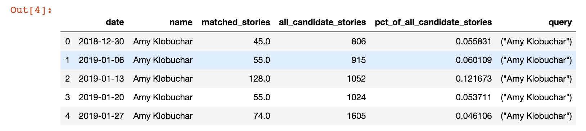

# Notebooks to Web Apps

I love Jupyter notebooks!  If I have the choice to code in a notebook vs another IDE, I will also choose a notebook! Recently, a new python library was released called [Streamlit](https://www.streamlit.io/) that lets you make really cool web apps quickly and simply.  By default, [Streamlit](https://www.streamlit.io/) only works with .py files and built in Jupyter functions cause errors :(  But with a little extra work, we can get it to work  in Jupyter. 


First let's import our data and make a streamlit bar graph. 

*For this example, we will be making a web app that shows Presidential Candidates's Online Attention.*

```python
df_online=pd.read_csv("https://raw.githubusercontent.com/fivethirtyeight/data/master/media-mentions-2020/online_weekly.csv")
df_online.head()
```



Let's process our data  so we can get number of stories and the candidate in one data frame. 

```python
dfO= df_online[['name','matched_stories']]

dfO= dfO.groupby("name")["matched_stories"].sum()
dfO = pd.DataFrame(dfO)

dfToShow= dfO.sort_values("matched_stories", ascending=False)
dfToShow.head()
```


Now, let's import streamlit and make a bar chart. 

```python
import streamlit as st
st.bar_chart(dfToShow)
```


If you have a markdown cell, switch it to a code cell and surround it with triple quotes 

```python

'''
# Creating Web Apps with JN and Streamlit
## Christian F. Jung
christianfjung.com

**About this Project** 

This project uses live poll data from 538 so the website will be update constantly!

'''
```


We've done our preprocessing, added text, and  we've made a bar chart with streamlit. Now it's time to make the app!


For an easy one line solution, use this script that I made. Replace `YOURNOTEBOOKNAME` with the name of your .ipynb; *(do not include the file extension)*. Save your notebook, then run the following cell. 

```python
! curl  https://scripts.christianfjung.com/JN-ST.sh | bash -s YOURNOTEBOOKNAME
```


If you prefer to write the script yourself use the following code instead:

```python
!jupyter nbconvert   --to script YOURNOTEBOOKNAME.ipynb
!awk '!/ipython/' YOURNOTEBOOKNAME.py >  temp.py && mv temp.py app.py && rm YOURNOTEBOOKNAME.py
!streamlit run app.py

```


**HOORAY!** You now have a running web app and will see a screen that looks like this! Visit the local url to see your site in action. *(The cell will continue to run so the site stays active, to stop the site, stop the cell).*


#### What does the script do?

1. Converts NB to .py: `jupyter nbconvert   --to script YOURNAME.ipynb`
2. Removes all ipython com
3. mands (includes the call to the script):
   `awk '!/ipython/' YOURNAME.py >  temp.py && mv temp.py app.py && rm YOURNAME.py`
4. Runs the local streamlit app:`streamlit run app.py`


---

For a complete working example, check out my [GitHub repo](https://github.com/ChristianFJung/NotebookToWebApp) for this article. 

Share with me your web apps!  Feel free to ask questions and stayed tuned for my next article where we deploy this app to a website!

Twitter: [@christianfjung](http://twitter.christianfjung.com)

[Linkedin](https://www.linkedin.com/in/christianfjung/)

[christianfjung.com](http://christianfjung.com)

